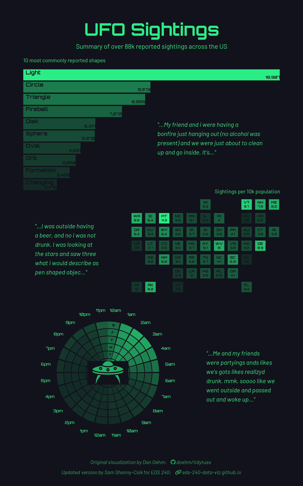

# UFO Visual Code Analysis

This repository contains responses to Homework 1 of EDS240: Data Visualization & Communication. The assignment dissects the code behind [Dan Oehn](https://gradientdescending.com/#google_vignette)'s visual summarizing UFO sightings in the United States (below). See the associated [tidytuesday README](https://github.com/rfordatascience/tidytuesday/blob/main/data/2023/2023-06-20/readme.md#data-dictionary) for more information on the data and project itself.



## Repository Structure
```
├── eds240-hw1-ufo.Rproj
├── fonts
│   ├── Font Awesome 6 Brands-Regular-400.otf
│   ├── Font Awesome 6 Free-Regular-400.otf
│   └── Font Awesome 6 Free-Solid-900.otf
├── HW1_files
│   └── libs
│       ├── bootstrap
│       │   ├── bootstrap-d6a003b94517c951b2d65075d42fb01b.min.css
│       │   ├── bootstrap-icons.css
│       │   ├── bootstrap-icons.woff
│       │   ├── bootstrap.min.css
│       │   └── bootstrap.min.js
│       ├── clipboard
│       │   └── clipboard.min.js
│       └── quarto-html
│           ├── anchor.min.js
│           ├── axe
│           │   └── axe-check.js
│           ├── popper.min.js
│           ├── quarto-syntax-highlighting-7b89279ff1a6dce999919e0e67d4d9ec.css
│           ├── quarto-syntax-highlighting.css
│           ├── quarto.js
│           ├── tabsets
│           │   └── tabsets.js
│           ├── tippy.css
│           └── tippy.umd.min.js
├── HW1.html
├── HW1.qmd
├── images
│   └── ufo.png
├── outputs
│   └── ufo_sightings_infographic.png
└── README.md
```
## Course Information

-   **Course Title:** [EDS 240 - Data Visualization & Communication](https://eds-240-data-viz.github.io/)
-   **Term:** Winter 2026
-   **Program:** [UCSB Masters in Environmental Data Science](https://bren.ucsb.edu/masters-programs/master-environmental-data-science).

Teaching Team:

-   **Instructor:** [Sam Shanny-Csik](https://github.com/samanthacsik)
-   **Co-Instructor:** [Annie Adams](https://github.com/annieradams)

Complete materials for this homeowork assignment can be found on the [course website](https://eds-240-data-viz.github.io/course-materials/assignments/HW1.html).

*This README was adapted from the README template provided in EDS220; see course details and original repository [here](https://github.com/sofiasarak/eds220-2025-in-class).*


